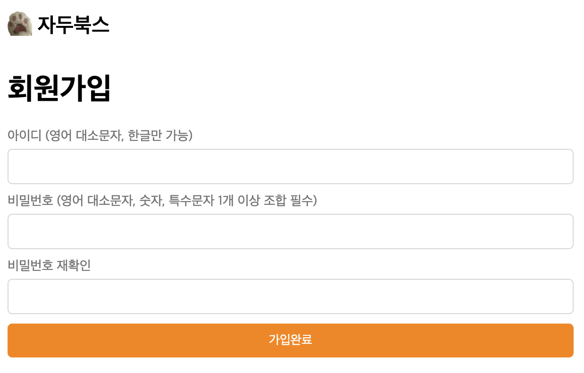
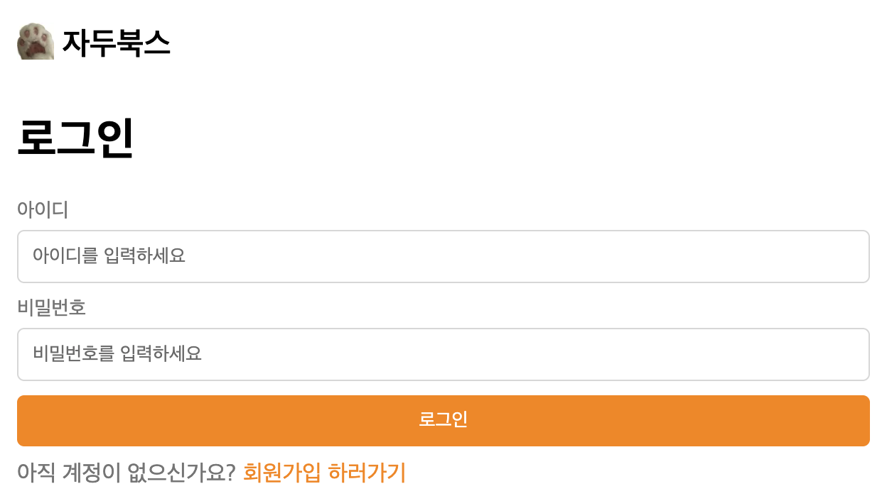
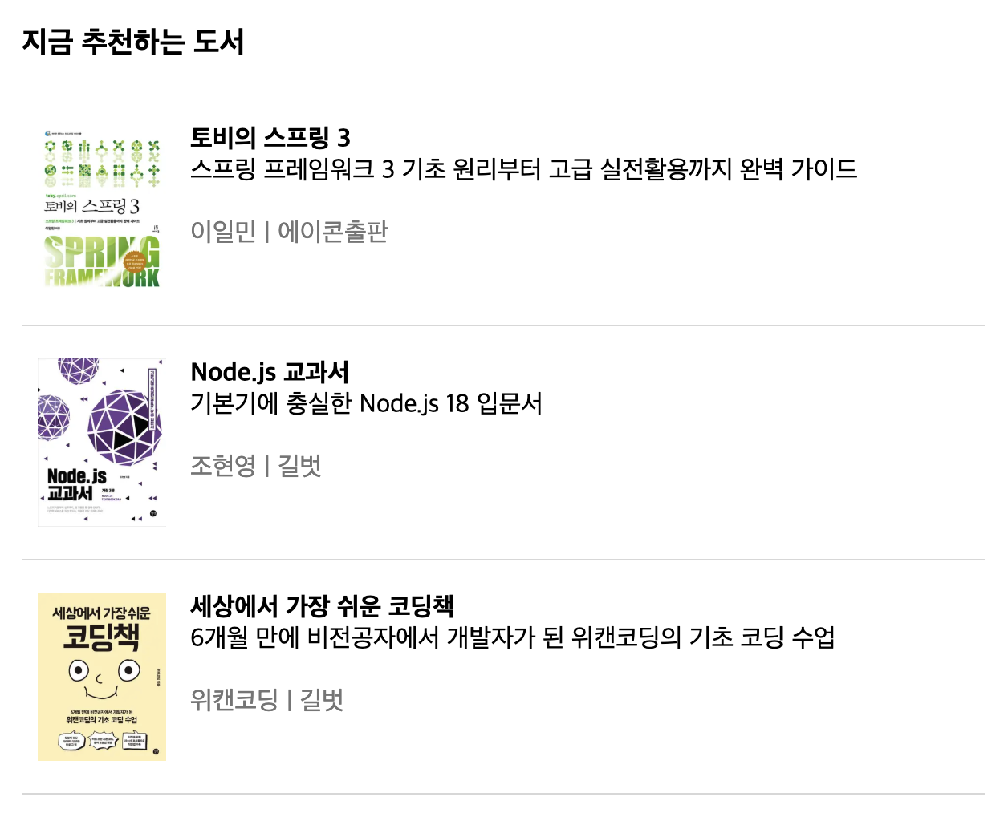
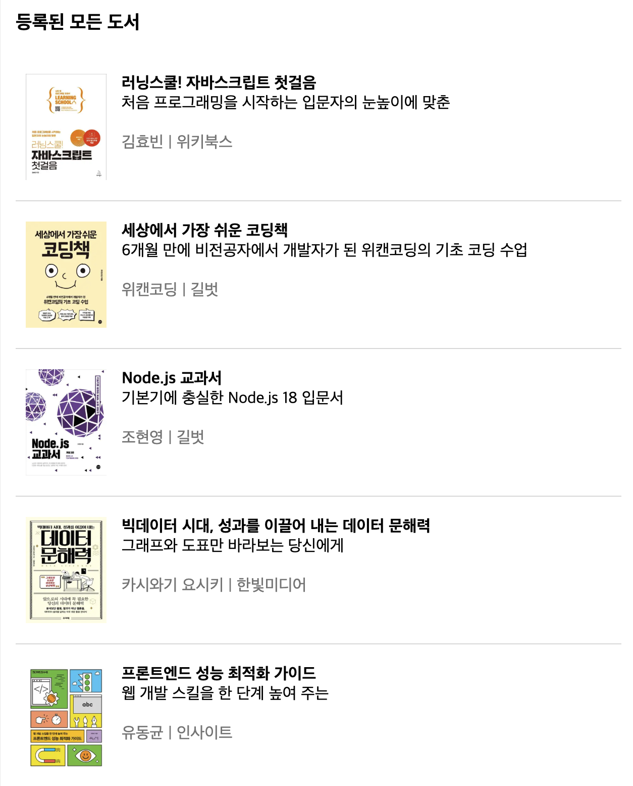
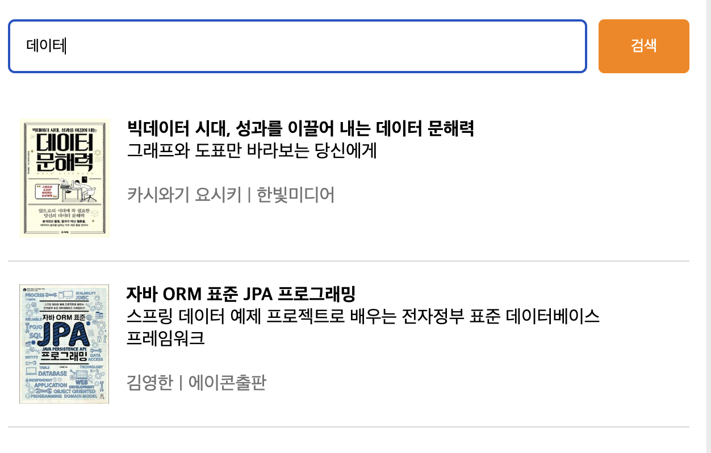
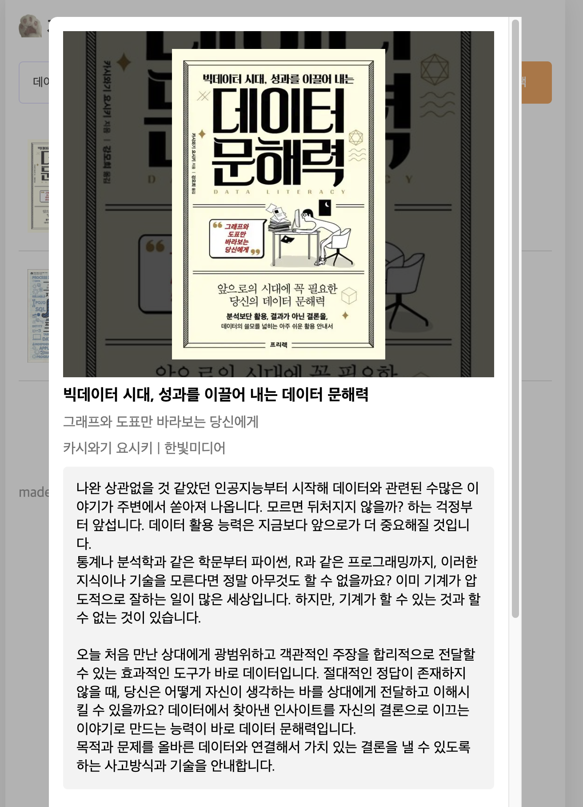
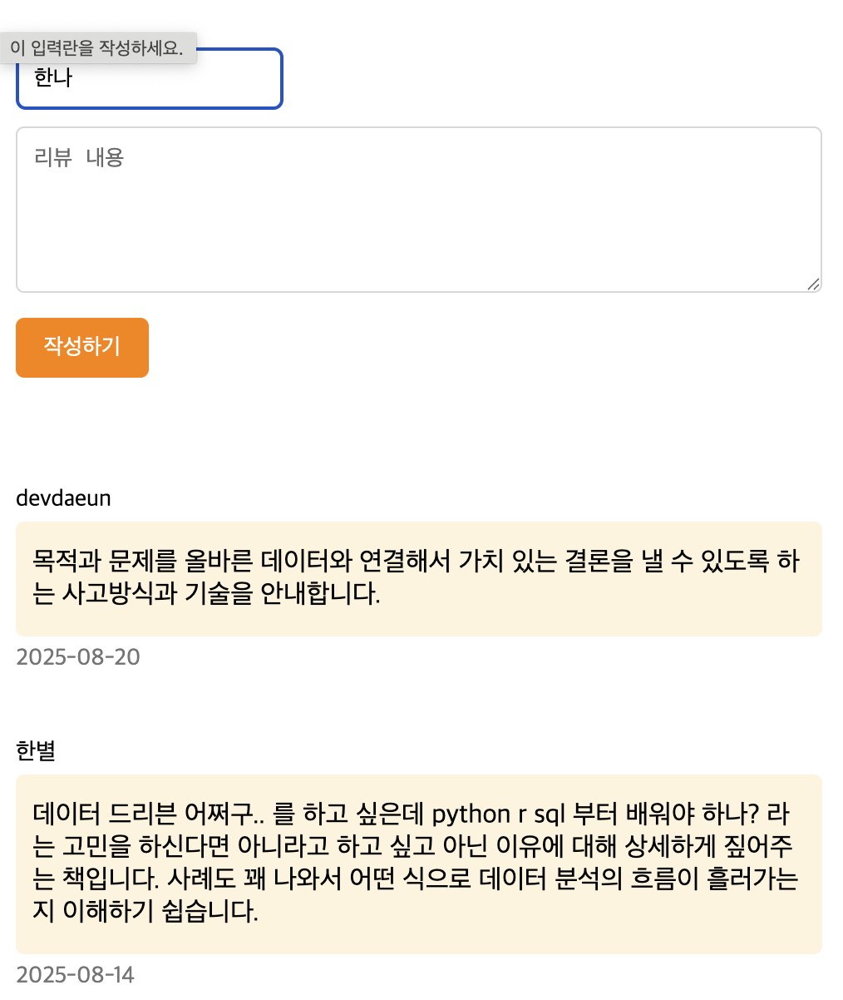
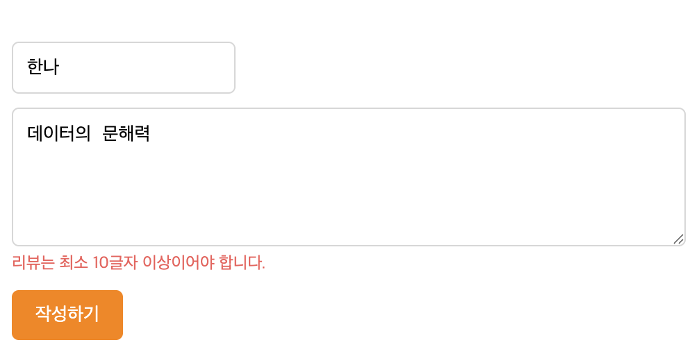
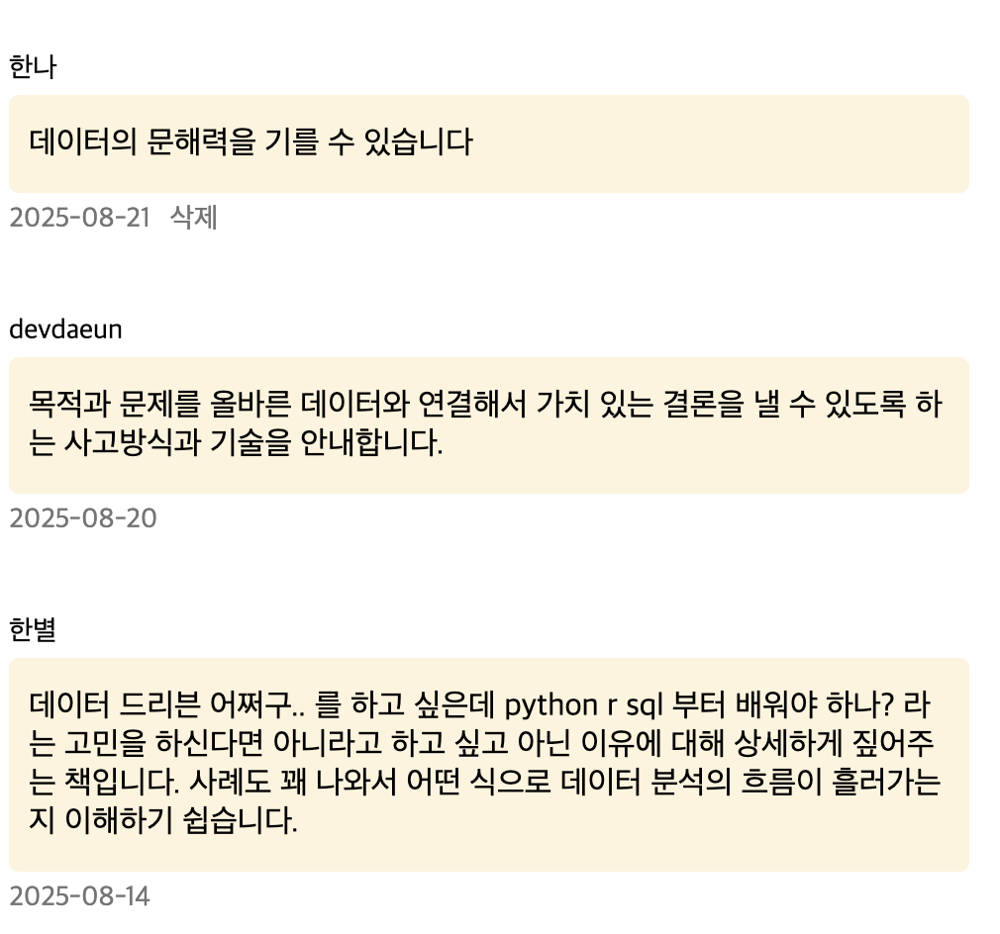
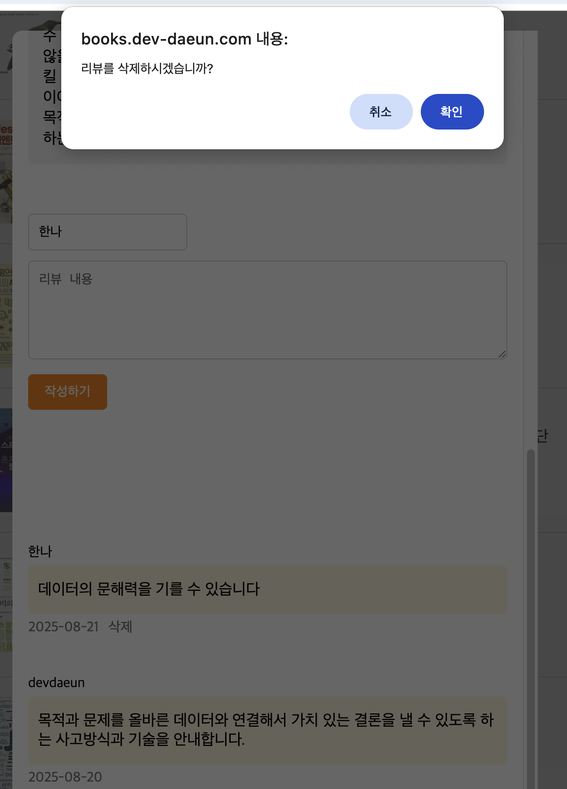

## Next.js로 구축한 책 관리 웹 애플리케이션 ['자두북스'](https://books.dev-daeun.com/)

### 프로젝트 소개
* 도서 목록을 조회하고 리뷰를 등록/삭제 할 수 있습니다
* 인프런 강의 [[한 입 크기로 잘라먹는 Next.js]](https://www.inflearn.com/course/%ED%95%9C%EC%9E%85-%ED%81%AC%EA%B8%B0-nextjs) 를 학습하며 만들었습니다
* 강의에서 다루지 않은 데이터 유효성 검사는 [zod](https://zod.dev/) 를 활용했습니다
* 강의에서 다루지 않은 인증 관련 기능은 [NextAuth.js](https://next-auth.js.org/) 를 활용했습니다

### 사용한 기술
* typescript@5.8.3
* next@15.4.5
* react@19.1.0
* zod@4.0.17
* next-auth@4.24.11

### 주요 기능
#### 1. 회원가입/로그인

#### 2. 추천 도서 목록 조회

#### 3. 전체 도서 목록 조회

#### 4. 도서 검색

#### 5. 도서 상세 정보(저자, 출판사, 설명) 조회

#### 6. 도서의 리뷰 목록 조회

#### 7. 도서 리뷰 작성

#### 7. 도서 리뷰 삭제

### 향후 개선/적용해보고 싶은 것
* 비즈니스 로직 담당하는 백엔드에서 응답 지연 시 모달 창에 suspense 적용
* 소셜 로그인
* 도서 목록 페이지네이션